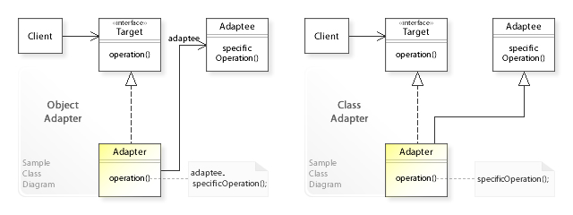

# 적응자(Adapter) 패턴 #

## What ##
클래스의 인터페이스를 사용자가 기대하는 인터페이스 형태로 적응(변환)시킨다.

서로 일치하지 않는 인터페이스를 갖는 클래스들을 함께 작동시킨다.

다른 이름으로는 `Wrapper`라고도 한다.

## When ##

* 기존 클래스를 사용하고 싶은데 인터페이스가 맞지 않을 때

* 이미 만든 것을 재사용하고자 하나 재사용 가능한 라이브러리를 수정 할 수 없을 때

* 이미 존재하는 여러개의 서브클래스를 사용해야 하는데, 이 서브클래스들의 상속을 통해서 이들의 인터페이스를 다 수정하는게 힘들 때



출처 : [http://w3sdesign.com/?gr=s01&ugr=struct](http://w3sdesign.com/?gr=s01&ugr=struct) 

```java
// 변경 불가한 외부 라이브러리를 사용하고자 하는 클래스 - 상단의 Client
public class RequestClient {

    private RequestInterface requestInterface;

    public RequestClient(RequestInterface requestInterface) {
        this.requestInterface = requestInterface;
    }

    public void execute() {
        requestInterface.sendRequest();
    }
}
```

```java 
// 이미 시스템 내부 수많은 곳에서 사용되어 변경의 리스크가 존재하는 인터페이스 - 상단의 Target
public interface RequestInterface {

    void sendRequest();
}
```

```java
// 사용하고자 하는 서드파티 라이브러리 - 상단의 Adaptee
public class ThirdPartyRequest {

    public void sendThirdPartyRequest() {
        String message = "this is third party request.";
        System.out.println(message);
    }
}
```

```java
// Adapter 패턴을 적용한 Adapter, Target을 구현하면서 Adaptee를 사용한다. - 상단의 Adapter
public class RequestAdapter implements RequestInterface {

    private ThirdPartyRequest thirdPartyRequest;

    public RequestAdapter(ThirdPartyRequest thirdPartyRequest) {
        this.thirdPartyRequest = thirdPartyRequest;
    }

    @Override
    public void sendRequest() {
        thirdPartyRequest.sendThirdPartyRequest();
    }
}
```