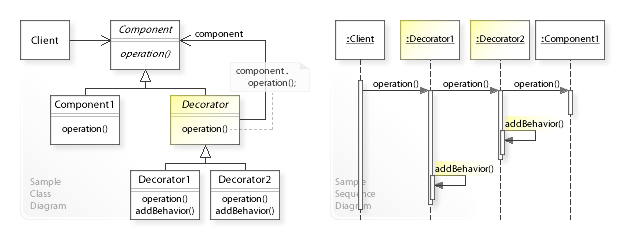

# 장식자(Decorator) 패턴 #

## What ##
객체에 동적으로 새로운 책임을 추가할 수 있게한다.

기능을 추가하려면 서브클래스를 생성하는 것보다 융통성 있는 방법을 제공한다.

쉽게 설명하자면 일반적으로 확장하기 위해서 상속을 통해 서브클래스를 생성한다.

근데 이러면 너무 클래스가 많아질 수 있음.

또한 추가되는 요소에 대해서 정적임(상속을 통해 서브클래스를 정의 -> Compile 단계)

이를 해결하기위해 객체에 `확장하고자 하는 구성요소로 둘러 싸는(Decorate)` 방식으로 해결하는데 이를 Decorator 패턴이라함.

## When ##

* 동적으로 투명하게(다른 객체에 영향을 주지않고) 각 객체에 새로운 책임을 부여하고 싶을 때에

* 확장할 케이스가 많은데 그때마다 상속을 하면 너무 많아질 것으로 판단될 때에




출처 : [https://en.wikipedia.org/wiki/Decorator_pattern](https://en.wikipedia.org/wiki/Decorator_pattern)

## Example ##

### Decorator의 대상이 되는 음료 ###

```java
// 기본 음료수
public abstract class Beverage {

    String description = "기본 음료수";

    public String getDescription() {
        return description;
    }

    public abstract double cost();
}

// 아메리카노
public class Americano extends Beverage {

    public Americano() {
        description = "아메리카노";
    }

    @Override
    public double cost() {
        return 3.0;
    }
}

// 모카
public class Mocha extends Beverage {

    public Mocha() {
        description = "모카";
    }

    @Override
    public double cost() {
        return 3.5;
    }
}
```

### 음료수에 추가할 Decorator ###
```java
// 음료에 넣는 기본 첨가물
public abstract class CondimentDecorator extends Beverage {

    public abstract String getDescription();
}

// 휘핑 크림
public class WhippingCreamDecorator extends CondimentDecorator {

    Beverage beverage;

    public WhippingCreamDecorator(Beverage beverage) {
        this.beverage = beverage;
    }

    @Override
    public double cost() {
        return beverage.cost() + 0.5;
    }

    @Override
    public String getDescription() {
        return beverage.getDescription() + " + " + "휘핑크림";
    }
}

// 디카페인
public class DecafDecorator extends CondimentDecorator {

    Beverage beverage;

    public DecafDecorator(Beverage beverage) {
        this.beverage = beverage;
    }

    @Override
    public double cost() {
        return beverage.cost() + 0.3;
    }

    @Override
    public String getDescription() {
        return beverage.getDescription() + " + " + "디카페인";
    }
}
```

### 위 정의한 내용을 기반한 테스트 ###

```java
@Test
@DisplayName("Decorator 패턴을 이용하여 음료에 여러 옵션을 추가할 수 있다.")
public void decorate_beverage_using_decorator() {
    Beverage decaffeinatedAmericano = new DecafDecorator(new Americano());
    Beverage whippedMocha = new WhippingCreamDecorator(new Mocha());
    Beverage decaffeinatedAndWhippedMocha = new DecafDecorator(new WhippingCreamDecorator(new Mocha()));

    // 아메리카노 + 디카페인
    System.out.println(decaffeinatedAmericano.getDescription());

    // 모카 + 휘핑크림
    System.out.println(whippedMocha.getDescription());

    // 모카 + 휘핑크림 + 디카페인
    System.out.println(decaffeinatedAndWhippedMocha.getDescription());

    // 3.0 + 0.3
    assertThat(decaffeinatedAmericano.cost()).isEqualTo(3.3);
    // 3.5 + 0.5
    assertThat(whippedMocha.cost()).isEqualTo(4.0);
    // 3.5 + 0.5 + 0.3
    assertThat(decaffeinatedAndWhippedMocha.cost()).isEqualTo(4.3);
}
```